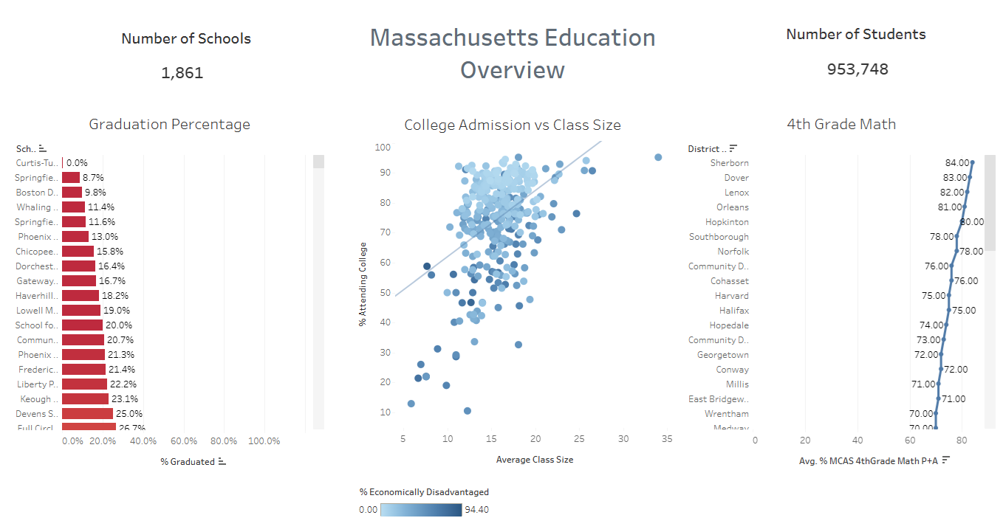
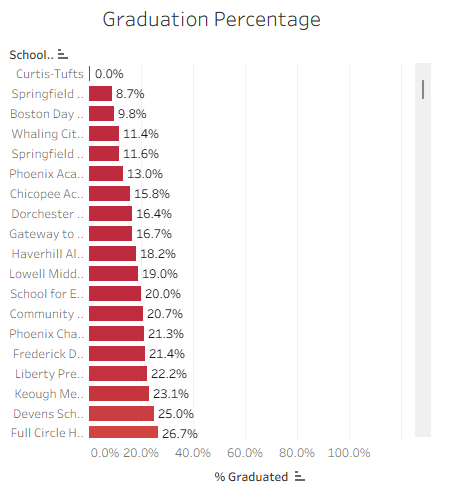

# Massachusetts Department of Education — Tableau Analysis

**By Aristotle Polites** | Data Analyst | Published: June 1, 2026

[](https://public.tableau.com/app/profile/aristotle.polites/viz/MassachusettsEducationOverview_17801698414110/MassachusettsEducationOverview)

🎥 **[Watch Full Walkthrough on Loom](https://www.loom.com/share/471f2e3f917042fe9dac6ab258877f9a)**

---

## Executive Summary

This project analyzes Massachusetts Department of Education public data covering **1,861 schools and 953,748 students**, built into an interactive Tableau dashboard to examine whether class size drives better student outcomes.

Three material findings emerged:

- Graduation rates vary dramatically across schools — from 100% to 0% — with economic disadvantage appearing to be a stronger explanatory variable than class size alone.
- Larger class sizes correlate with higher college admission rates at the aggregate level, but schools with higher economic disadvantage consistently fall below the trend line, suggesting class size is a proxy rather than a driver.
- A small number of charter districts (e.g., Community Day Charter Public School) achieve 4th Grade MCAS proficiency rates above 50%, outperforming comparable schools in ways worth investigating for replication.

---

## Business Questions

1. Which schools have the highest and lowest graduation rates, and what patterns emerge at the extremes?
2. Does class size correlate with college admission rates — and does economic disadvantage explain the variation?
3. Which districts and schools show exceptional 4th Grade MCAS math proficiency, and what might explain their performance?
4. Are there school-level patterns that suggest systemic drivers of underperformance vs. overperformance?

---

## Data Sources

| Dataset | Description |
|---|---|
| Massachusetts Dept. of Education | Public school-level data: graduation rates, class size, college admission rates, 4th Grade MCAS proficiency |

- Coverage: 1,861 schools, 953,748 students
- Source: Massachusetts Department of Education public data export
- Format: Structured tabular data loaded into Tableau for visualization and analysis

---

## Tools & Skills Used

- **Tableau** — Interactive dashboard, calculated fields, trend lines, scatter plots, bar charts
- **Data visualization** — Multi-view dashboard design with school- and district-level filtering
- **Exploratory analysis** — Identifying outliers, trend lines, and demographic breakdowns

---

## Key Findings

### 1. Graduation Rates: Wide Variance with Outliers at Both Ends

Most Massachusetts schools graduate 100% of their students. Curtis Tufts sits at 0%. The data surfaces what is happening — the harder analytical work is identifying why. Economic disadvantage, curriculum, and staffing quality are candidate variables, but a single-year snapshot cannot isolate cause from correlation.



### 2. Class Size vs. College Admission Rates — Not the Story You'd Expect

The expected relationship — smaller classes, better outcomes — does not hold in aggregate. The trend line shows larger class sizes correlating with higher college admission rates. The important nuance: schools with higher economic disadvantage consistently fall below that trend line. Class size may be acting as a proxy for school resource level and demographics rather than as an independent driver of college outcomes.


### 3. 4th Grade MCAS Proficiency: Charter Schools as Outliers Worth Studying

Community Day Charter Public School posts 50%+ passing rates on 4th Grade MCAS math — well above comparable district schools. The question is not just what their numbers are, but what operational or instructional decisions explain the gap. That type of insight is what moves from descriptive analytics to actionable policy.


---

## Key Recommendations

- **Shift from snapshot to trend analysis.** A single year identifies where performance stands; multi-year data identifies which schools are improving or declining — and at what rate. The Massachusetts DOE should prioritize longitudinal tracking to enable predictive rather than reactive intervention.
- **Investigate economic disadvantage as the primary confound.** The class size vs. college admission finding suggests economic disadvantage may be the dominant variable. Controlling for it would clarify whether class size policy changes would produce measurable outcome improvements.
- **Study high-performing outliers systematically.** Community Day Charter and similar districts are achieving materially better outcomes than predicted by their demographics. Structured case studies of their instructional and operational models could surface replicable practices for district-level adoption.

---

## Data Cleaning, Assumptions & Limitations

- Analysis reflects a single academic year; year-over-year trends are not available in this dataset.
- Economic disadvantage data is used directionally as a visual overlay; it was not controlled for in a formal regression model.
- School-level class size figures represent averages and may mask within-school variation across grade levels and subject areas.
- Charter and district schools are included in the same analysis; structural and funding differences between school types were not adjusted for.
- MCAS proficiency is limited to 4th Grade math; it is not representative of overall school academic performance.

---

## Project Structure

```
massachusetts-education-analysis/
├── Mass_Edu_Dash.png          # Dashboard overview screenshot
├── Grad_rate.png              # Graduation rate visualization
├── College_vs_class_size.png  # Class size vs. college admission scatter
├── 4th_grade_math.png         # 4th Grade MCAS proficiency chart
└── README.md
```
