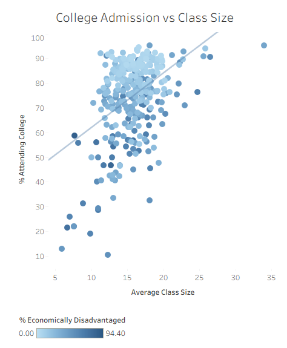
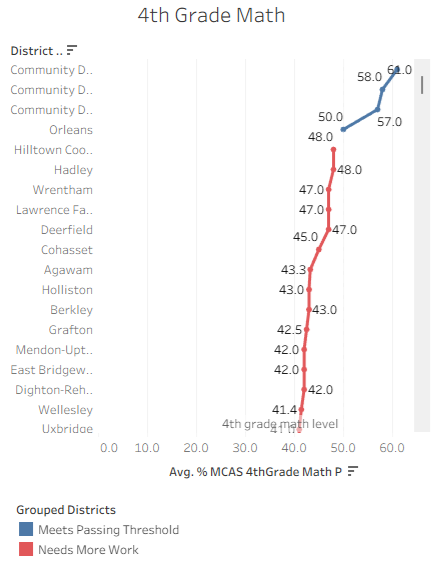

# Bigger Classes, Better Outcomes?

**By Aristotle Polites** | Data Analyst | Published: June 1, 2026

📊 **[View Interactive Tableau Dashboard](https://public.tableau.com/app/profile/aristotle.polites/viz/MassachusettsEducationOverview_17801698414110/MassachusettsEducationOverview)**
🎥 **[Watch Full Walkthrough on Loom](https://www.loom.com/share/471f2e3f917042fe9dac6ab258877f9a)**

---

## Project Overview

I dug into Massachusetts Department of Education data — **1,861 schools, 953,748 students** — and built an interactive Tableau dashboard to find out whether bigger class sizes lead to better outcomes.

---

## Key Findings

### 1. Graduation Rates
Many Massachusetts schools graduate 100% of their students. But Curtis Tufts sits at 0%. Data can tell you *what* is happening. The harder work is figuring out *why* — is it economic disadvantage? Curriculum? Teaching staff? That's where the real investigation begins.

### 2. Class Size vs. College Admission Rates
I assumed smaller classes meant more teacher time per student and better college outcomes. **The trend line disagreed.**

Larger class sizes actually correlated with higher college admission rates — but here's the nuance: schools with higher economic disadvantage consistently fell below that trend line. So class size may not be the real driver — **economic disadvantage might be the bigger factor worth investigating.**

### 3. 4th Grade MCAS Proficiency: Bright Spots Worth Studying
Some districts are exceptional — **Community Day Charter Public School** stands out with 50%+ passing rates. The question isn't just what their numbers are, but what they're doing differently. That's the kind of insight that can actually move the needle for struggling schools.

---

## Recommendation to the Department of Education

Look at trends over time. Which schools are improving rapidly? Which are declining? A single snapshot tells you where things stand — multi-year data tells you where they're heading. The real goal: **move from describing outcomes to actually improving them.**

---

## Tools Used
- **Tableau** — Interactive dashboard and data visualization
- **Massachusetts Department of Education** — Public education dataset

---

## Tags
`#DataAnalytics` `#Tableau` `#EducationData` `#Massachusetts` `#DataVisualization` `#PublicPolicy` `#StudentSuccess`
